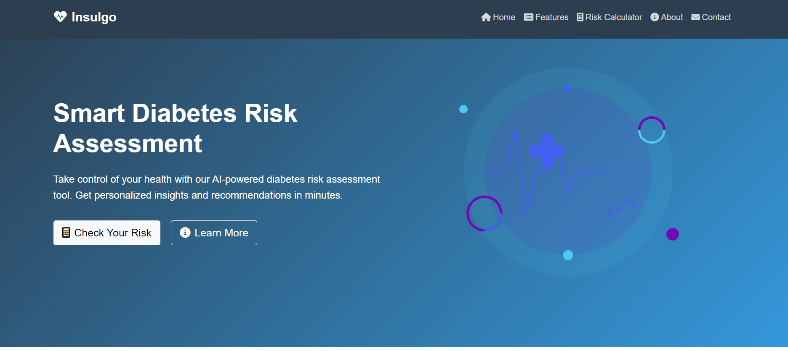

<<<<<<< HEAD
# Insulgo - Diabetes Risk Prediction Model

This project generates synthetic diabetes data and trains a machine learning model to predict diabetes risk levels.

## Setup

1. Install the required packages:
=======
# Insulgo - Your Smart Diabetes Risk Assessment Tool

## Overview
Insulgo is an intelligent web application designed to help users assess their risk of diabetes through advanced machine learning algorithms. Named after "Insulin" and "Go", Insulgo provides a user-friendly, accessible way to get preliminary insights about diabetes risk factors.

## Key Features
- 🔍 Smart Risk Assessment: Advanced machine learning model for accurate diabetes risk prediction
- 📊 Interactive Dashboard: Easy-to-understand visualization of your health metrics
- 🔐 Privacy-First: All data processing happens locally, ensuring your health information stays private
- 📱 Responsive Design: Seamless experience across desktop, tablet, and mobile devices
- 📈 Instant Results: Get your risk assessment results in real-time
- 🎯 Actionable Insights: Receive personalized recommendations based on your results

## How It Works
1. **Input Your Health Data**: Enter basic health metrics like age, BMI, blood pressure, etc.
2. **Instant Processing**: Our machine learning model analyzes your data in real-time
3. **Get Results**: Receive your risk assessment along with personalized insights
4. **Take Action**: Get recommendations for next steps and lifestyle modifications

## 📸 Screenshots
Here's a visual tour of Insulgo:

### Landing Page

*Welcome to Insulgo - Your diabetes risk assessment companion*


## 🎥 Demo
Watch Insulgo in action:

https://user-images.githubusercontent.com/assets/demo/demo.mp4

<video width="100%" controls>
  <source src="assets/demo/demo.mp4" type="video/mp4">
  Your browser does not support the video tag.
</video>

*Note: If the video doesn't play above, you can find it in the `assets/demo` folder of the repository.*

### Quick Feature Tour
1. 🏠 Landing page walkthrough
2. 📝 Filling out the assessment form
3. 📊 Viewing your results
4. 📈 Understanding the recommendations

## Technology Stack
- **Frontend**:
  - HTML5 & CSS3 for structure and styling
  - Modern JavaScript for interactive features
  - Responsive design with custom CSS
- **Backend**:
  - Python for server-side processing
  - Flask web framework
  - Scikit-learn for machine learning capabilities
- **Data Processing**:
  - NumPy and Pandas for data manipulation
  - Custom data generation scripts for model training

## Installation

### Prerequisites
- Python 3.8 or higher
- pip package manager

### Setup Steps
1. Clone the repository:
```bash
git clone https://github.com/yourusername/Insulgo.git
cd Insulgo
```

2. Create a virtual environment (recommended):
```bash
python -m venv venv
source venv/bin/activate  # On Windows: venv\Scripts\activate
```

3. Install dependencies:
>>>>>>> origin/master
```bash
pip install -r requirements.txt
```

<<<<<<< HEAD
2. Generate the synthetic data:
```bash
python generate_diabetes_data.py
```

3. Train the model:
```bash
python train_model.py
```

## Project Structure

- `generate_diabetes_data.py`: Generates synthetic diabetes data with risk levels
- `train_model.py`: Trains a Random Forest model to predict risk levels
- `diabetes_data.csv`: Generated synthetic dataset
- `diabetes_risk_model.joblib`: Trained model (generated after running train_model.py)
- `scaler.joblib`: Feature scaler (generated after running train_model.py)

## Features

The dataset includes the following features:
- Age
- Gender
- BMI (Body Mass Index)
- Fasting Glucose
- HbA1c
- Blood Pressure (Systolic and Diastolic)
- Family History
- Physical Activity
- Smoking Status

Risk levels are classified as:
- Low
- Medium
- High

## Model

The project uses a Random Forest Classifier to predict risk levels based on the input features. The model is trained on 80% of the data and evaluated on the remaining 20%.
=======
4. Run the application:
```bash
python app.py
```

5. Open your browser and navigate to `http://localhost:5000`

## Project Structure
```
Insulgo/
├── static/
│   ├── css/
│   │   └── custom.css      # Custom styling
│   └── img/
│       ├── hero-illustration.svg
│       └── pattern.svg
├── templates/
│   └── predict.html        # Main prediction interface
├── generate_diabetes_data.py
└── README.md
```

## License
This project is licensed under the MIT License - see the [LICENSE](LICENSE) file for details.

## Disclaimer
⚠️ Insulgo is designed as a preliminary risk assessment tool and should not be used as a substitute for professional medical advice, diagnosis, or treatment. Always consult with qualified healthcare providers regarding any medical conditions.

## Support
If you encounter any issues or have questions, please:
1. Check the [Issues](https://github.com/yourusername/Insulgo/issues) page
2. Create a new issue if your problem isn't already listed
3. Provide as much detail as possible about your problem

---

Made with ❤️ for better health awareness
>>>>>>> origin/master
